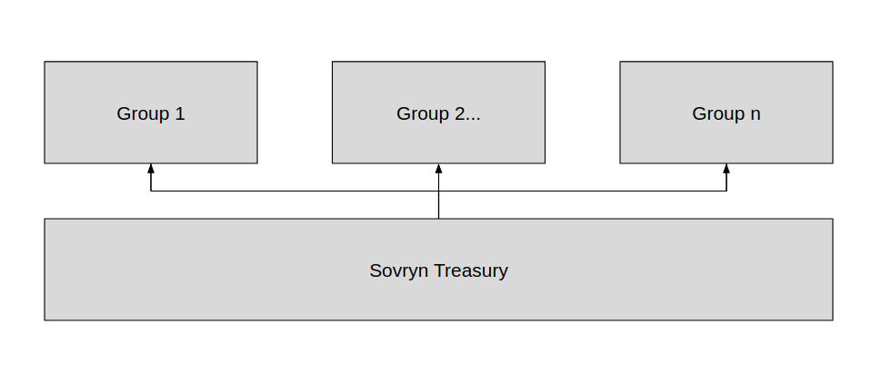

# The Sovryn Budget System

There is a short term need to create a budget and organization structure that minimizes the number of transactions going through the Sovryn Treasury. 

## Two-tier structure
What is proposed is a two-tier structure, with the Sovryn Treasury at Tier 1 and organization “groups” at Tier 2.

Each group would have its own multisig composed of at least 3 members, with a majority vote  (e.g. 2-of-3) required to enact payments from the group to end recipients. To make budgeting for each group easier, groups are to be broken into functional units for each major area of work e.g. Product, Adoption, Operations, etc.

## Budgeting
Once groups are formed, there are two steps to creating the budget:
1. Decide the total budget per period  
2. Allocate the budget to groups

One way to decide the budget is in a top down way. Total available funds are assessed and a budget is derived from that. For example, total available funds are 300 BTC, we want this to last at least 3 years, and so we allocate 50 BTC to Year 1, 100 BTC to Year 2, and 150 BTC to Year 3, anticipating that spending will increase as time goes on and the project grows. Groups will then negotiate with each other for a share of the total budget.

Another way to decide the total budget is in a bottom up way. Here, groups will create budget proposals per period and come together to consider the total cost of all of the proposals and whether any of the proposals should be adjusted up or down based on the total cost. This method may be biased to overspending, since groups may try to request as much money as they think they can get away with during a given period, but with discipline and honest negotiation may also be a more realistic reflection of spending needs since the total budget is decided directly by the groups who need and will be making use of budgeted funds.

Once the total budget and individual group allocations have been determined using one of the above methods (or another method not explored here) then groups can make proposals to the Sovryn Treasury to receive the funds.

## Distributing funds to groups

#### Option 1. Manual payments

The first option for getting funds from the multisig to each group is to manually push a payment from the multisig to each group at set intervals e.g. monthly, quarterly, annually, or as needed. The group would receive its budget for that budget period, and distribute amongst themselves as needed.

For example, Group A gets a budget of 3 BTC per quarter. At the beginning of the quarter, the multisig sends 3 BTC to the Group A multisig. Group A then distributes the 3 BTC amongst themselves until the end of the quarter, when they will expect to receive their next budget allocation.

#### Option 2. Streaming payments

The second option for getting funds from the multisig to each group is to set up a payment stream from the multisig to each group using a tool such as [Superfluid](https://www.superfluid.finance/). The stream would be set to correspond with the group’s budget for a given time period e.g. monthly, quarterly, annually, etc. At any point during the stream, the group can pull funds from the stream that have been made available since the last time they pulled from the stream. The main benefit here is that the budget can be set and allocated for extended periods of time without having to trust the recipient group with a large amount of funds up front.

For example, Group A gets a budget of 3 BTC per quarter. At the end of Month 1, Group A can pull up to 1 BTC from their stream, and they do decide to pull the maximum 1 BTC from the stream. At the end of Month 3, Group A can pull up to the remaining 2 BTC from the stream, and they do decide to pull that remaining 2 BTC to cover their budgetary needs.

## Managing budget allocations
To ease budget management, budget allocations received by each group can be converted to stablecoins either prior to or immediately following receipt from the multisig. This way the runway available is predictable for the duration of the budget period.

Each group can decide how to manage contracts with team members and third-party vendors. The general workflow should be that a contract is created specifying work to be done, the cost of work, and when payments are due. When payment is due, the contractor can send an invoice to the multisig members specifying the payment period, the amount due, and the payment address. The multisig members will then make arrangements to process the invoice and pay out the amount due.

## Considerations
There are several issues to consider before allocating funds through multisig groups this way, including:

- Legal liability for multisig members  
- Tax treatment for multisig members  
- Contingency plans in case of signer unavailability  
- Multisig key management and security  
- Fund stability through market cycles

#### Legal liability

Multisig group members should take into consideration any legal liability that they may open themselves up to by participating as a signer on a group multisig. Potential liability includes tort liability, in case of claims for damages that may arise e.g. in case a payment is delayed or cancelled, and criminal liability in case a payment made ends up crossing a legal line. Multisig group members should talk to a lawyer to understand their liability and how/if they can adequately manage it.

#### Tax treatment

Multisig group members should take into consideration how funds sent and received via the group multisig will be treated in their jurisdiction for tax purposes. In some jurisdictions, the multisig may be treated as an “unincorporated nonprofit association” for tax purposes, with no additional tax liability for members if all incoming funds are spent on the group’s activities. Other jurisdictions may treat the multisig as a kind of business venture, potentially opening up the members to tax liabilities for any funds received. Multisig group members should talk to a tax expert in their jurisdiction to understand how their participation in the multisig will be treated for tax purposes.

#### Contingency plans

By its nature, m-of-n multisig wallets are resilient to a certain level of failure. Groups should prepare protocols ahead of time for key rotation in case one or more keys become unavailable. 

In case m-of-n or more keys become unavailable, funds could potentially be lost forever. To prevent permanent loss of funds, an “escape hatch” could be built into the multisig wallet that will send the funds back to the Sovryn treasury in case the wallet is inactive for a certain period of time. The group could then re-form with new keys and request its remaining budget from the Sovryn treasury.

#### Multisig security

To prevent funds from being lost or stolen, groups should take care to protect the keys used for the multisig. It is recommended that keys should be generated and managed exclusively via hardware wallets compatible with the multisig software that the group will use to manage their funds. Seed backups should never be typed into or stored on a computing device with internet access. If a seed backup is kept, for extra security the seed phrase can be stored using a damage-resistant [steel backup](https://jlopp.github.io/metal-bitcoin-storage-reviews/) tool.

Care should be taken when spending funds from the multisig to visually confirm all transactions that are being signed on the hardware wallet screen. Attacks [have been seen in the wild](https://medium.com/@hugh_karp/nxm-hack-update-72c5c017b48) that trick targets into signing a transaction that does not match what was expected. Double-checking transaction metadata using the secure hardware wallet screen to ensure it matches what is expected can prevent these kinds of attacks from succeeding.

## Fund stability

Most of the funds raised by Sovryn have been in BTC and RBTC. While everyone in the project is bullish on bitcoin long term, the short term future price is always unknown. This opens up a small but real risk of the project losing significant amounts of runway in a short period of time.

There is a [well-known story](https://blog.ethereum.org/2015/09/28/the-evolution-of-ethereum/) about how the Ethereum Foundation almost went broke after the BTC they raised in their 2014 crowdsale dropped in value by a significant amount. Sovryn may want to avoid the same fate by selling a portion of (R)BTC raised for stablecoins that are unlikely to face the same depreciation risk. Or, if SOV holders are so bold, they could use Sovryn itself and other lending platforms to borrow stablecoins against Sovryn Treasury (R)BTC holdings in anticipation of the BTC price going up long term (at the risk of liquidation should the BTC price decline too much).

## Future work
Once we get past this short term need for a “quick and dirty” solution to the problem of budgeting and fund management, we can explore more sophisticated tools such as [BudgetBox](https://colony.io/budgetbox.pdf) or [CoBudget](https://cobudget.co/) for budgeting and [onchain DAO smart contracts](https://github.com/AutarkLabs/open-enterprise) for fund management.
